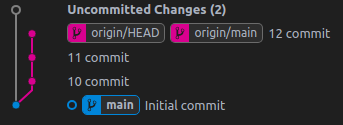
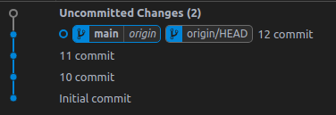
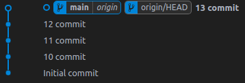
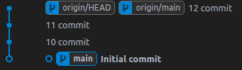

- [Git documentation](https://git-scm.com/docs/git#_main_porcelain_commands)

<p align="left"><b>Работа с Git репозиторием</b></p>

- [Создание/клонирование Git репозитория](#1)

<p align="left"><b>Работа с ветками</b></p>

- [Создать ветку](#2)
- [Запушить ветку](#2.1)
- [Удалить (local) ветку](#2.2)
- [Удалить (remote) ветку](#2.3)
- [Слияние двух веток в одну](#2.4)

<p align="left"><b>Работа с коммитами</b></p>

- [Получить информацию о коммитах](#3)
- Откатиться до коммита [ [документация Git](https://git-scm.com/docs/git-reset#Documentation/git-reset.txt-emgitresetemltmodegtltcommitgt) ]
    - [Мягкий откат проекта/файла/директории до коммита](#3.1)
    - [Жесткий откат проекта до коммита](#3.2)

<p align="left"><b>Работа с состоянием файлов</b></p>

- [Подтянуть состояние файлов из коммита или ветки](#4)
- [Хранение и управление не закоммиченными изменениями](#4.1)
- [Просмотр файловой структуры ветки или коммита](#4.2)
- [Просмотр содержимого файла из ветки или коммита](#4.3)

---

<h3 id="1" align="center">Создание/клонирование Git репозитория</h3>

Лучший способ запустить новый проект - создать его на GitHub и затем клонировать его.

```sh
# В директорий где будет расположен проект сделать git clone.
git clone {repo_url}
git clone git@github.com:Deyvidas/test_repo.git

# Перейти в директорию проекта.
cd {repo_directory}
cd test_repo
```

<p align="center">~~~</p>

Но бывает и так, что необходимо загрузить проект с локального компа на GitHub.

```sh
# Инициализировать локально Git репозиторий с веткой {branch_name}.
git init -b {branch_name}
git init -b main

# Добавить в индекс все файлы и директории.
git add .

# Зафиксировать состояние всех файлов в индексе.
git commit -m '{some_message}'

# Затем необходимо создать проект на GitHub.
...

# Сохранить ссылку, на GitHub репозиторий с названием в переменную {repo_tag}.
git remote add {repo_tag} {repo_url}
git remote add origin git@github.com:Deyvidas/test_repo.git

# Запушить состояние ветки {branch_name} в репозиторий с тэгом {repo_tag}.
git push {repo_tag} -u {branch_name}
git push origin -u main

# Можно запушить состояние ветки на прямую через {repo_url} но в дальнейшем
# будет сильно не удобно каждый раз вбивать url репозитория, по этому лучше
# все-таки сохранять {repo_url} в переменную.
git push {repo_url} -u {branch_name}
git push git@github.com:Deyvidas/test_repo.git -u main
```

---

<h3 id="2" align="center">Создать ветку</h3>

```sh
# Создать новую ветку с названием {branch_name}.
git branch -c {branch_name}
git branch -c branch1

# Переключиться на ветку {branch_name}.
git switch {branch_name}
git switch branch1

# Создать и сразу-же переключиться на ветку {branch_name}.
git switch -c {branch_name}
git switch -c branch1

# Создать новую ветку с состоянием указанного коммита.
git switch -c {branch_name} {commit}
git switch -c branch1 45e78a...
# Получить список последних {n} коммитов:
git log -n {n}

# Создать новую ветку с состоянием {n} коммитов назад от текущего состояния ветки.
git switch -c {branch_name} @{n}
git switch -c branch1 @{1}
```

---

<h3 id="2.1" align="center">Запушить ветку</h3>

```sh
# Запушить одну или больше веток в репозитории {repo_tag}.
git push {repo_tag} -u {branch1} ... {branch_n}
git push origin -u branch1 branch2
# Просмотр всех доступных репозиториев {repo_tag}:
git remote -v
```

---

<h3 id="2.2" align="center">Удалить (local) ветку</h3>

```sh
# Удалить одну или больше веток.
git branch -d {branch1} ... {branch_n}
git branch -d branch1 branch2
```

---

<h3 id="2.3" align="center">Удалить (remote) ветку</h3>

```sh
# Удалить одну или больше веток из репозитория {repo_tag}.
git push {repo_tag} -d {branch1} ... {branch_n}
git push origin -d branch1 branch2
# Посмотреть какая ветка {branch_name} к какому репозиторию {repo_tag} относиться:
git branch -avv
```

---

<h3 id="2.4" align="center">Слияние двух веток в одну</h3>

Перед слиянием двух веток желательно, что-бы обе ветки не имели "висящих" изменений.
(Перед слиянием сделать push всех изменений, в обеих ветках)

Что-бы Git сгенерировал текст с описанием {n} последних коммитов можно использовать
флаг `--log[={n}]` если не указать `={n}` то в тело коммита включаются описание
последних 20 коммитов.

```sh
# Слить в принимающую ветку все изменения отдающей ветки.
[ user@ubuntu ] [ ~/.../some_project ] [ {accept_branch} ]
$ git merge {give_branch}
$ git merge {give_branch} --log[={n}]

# Пример - в ветку 'main' слить ветку 'feature2'.
[ user@ubuntu ] [ ~/.../some_project ] [ main ]
$ git merge feature2
$ git merge feature2 --log=30
```

Во время слияния могут возникнуть коллизии (конфликты) например:

- в ветке `main` в файле `foo.py:9` содержится строка `def function_of_main():`
- в ветке `feature2` в файле `foo.py:9` содержится строка `def function_of_feature2():`

В данном случае придется выбрать что-то одно, и при этом нужно учитывать, что
данная функция может использоваться где-то и если её переименовать то приложение
может сломаться.

После решения конфликта необходимо закоммитить изменения (после тщательной проверки).


```sh
# Проверит статус, добавить в индекс необходимые изменения и закоммитить.
[ user@ubuntu ] [ ~/.../some_project ] [ main ]
$ git status
$ git add .
$ git merge --continue  # Можно просто git commit.

# Запушить ветку.
[ user@ubuntu ] [ ~/.../some_project ] [ main ]
$ git push {repo_tag} -u {branch_name}
$ git push origin -u main
```

---

<h3 id="3" align="center">Получить информацию о коммитах</h3>

```sh
# Получить информацию обо всех коммитах.
git log

# Получить информацию о последних {n} коммитах.
git log -n {n}
git log -n 2
```

---

<h3 id="3.1" align="center">Мягкий откат проекта/файла/директории до коммита</h3>


При **мягком откате не теряются изменения сделанные в промежутке между моментом
отката и {commit}**, и все те изменения которых нет в {commit} будут считаться новыми.

Например в commit-е ... не-было файла some_file.txt но в момент отката этот файл
существовал, тогда после выполнения reset этот файл будет считаться новым.

После мягкого отката переносятся ВСЕ файлы/изменения, даже те, которых не было в
индексе или не небыли закоммиченными.

<p align="center">***</p>

```sh
# Откатить состояние всего проекта (с сохранением содержания проекта).
git reset --soft {commit}
git reset --soft e8738e...

# Добавляем в индекс все необходимое.
git add .

# Делаем commit
git commit -m '{message}'

# Делаем force push.
git push {repo_tag} -uf {branch_name}
git push origin -uf main
```

<p align="center">
    
    >>>
    
</p>

В данном примере видно, что если откатить весь проект до 'initial commit' то мы
потеряем все коммиты в промежутке между HEAD и 'initial commit'.

<p align="center">***</p>

```sh
# Откатить состояние отдельных файлов (с сохранением содержимого в них).
git reset --soft {commit} -- {path1} ... {path_n}
git reset --soft e8738e... -- ./bar.py ./baz.py

# Добавляем в индекс все необходимое.
git add {path1} ... {path_n}
git add ./bar.py ./baz.py

# Делаем commit
git commit -m '{message}'

# Делаем force push.
git push {repo_tag} -uf {branch_name}
git push origin -uf main
```

<p align="center">
    
    >>>
    
</p>

---

<h3 id="3.2" align="center">Жесткий откат проекта до коммита</h3>

Жесткий откат - **полностью приводит состояние проекта до состояния, в котором он
был в коммите {commit}, удаляя ВСЕ проиндексированные и ВСЕ локальные изменения**.

Например: если до reset в проекте был файл some_file.txt, **даже если он был
закоммичен**, но в коммите {commit} этого файла еще не существовало то он удалится.

- Что-бы сохранить не закоммиченные изменения нужно воспользоваться командой [stash](#4.1)
  **перед выполнением команды reset**.
- Восстановить удаленные файлы можно командой [restore](#4) **перед тем как
  запушить ветку** ( [просмотр файловой структуры](#4.2), [просмотр содержимого файла](#4.3) )

```sh
# Откатить состояние всего проекта (с удалением всего, чего нет в {commit}).
git reset --hard {commit}
git reset --hard e35694...

# ---------------------------------- optional ---------------------------------

# Восстанавливаем удаленные файлы (если необходимо).
git restore --source={commit|branch_name} --worktree {path1} ... {path2}
git restore --source=22c069... --worktree .baz.py ./dir/baz.py

# Добавляем локальные изменения из stash-а (если необходимо).
git stash pop stash@{stash_id}
git stash pop stash@{0}

# Добавляем в индекс все необходимое.
git add {path1} ... {path_n}
git add ./bar.py ./dir/baz.py
git add .

# Делаем commit
git commit -m '{message}'

# -------------------------------- end optional -------------------------------

# Делаем force push.
git push {repo_tag} -uf {branch_name}
git push origin -uf main
```

<p align="center">
    После push-а ветки с восстановлением файлов:<br>
    
    >>>
    
</p>

<p align="center">
    После push-а голой ветки:<br>
    
    >>>
    
</p>

---

<h3 id="4" align="center">Подтянуть состояние файлов из коммита или ветки</h3>

```sh
# Подтянуть состояние из последнего коммита в ветке {branch_name}.
git restore --source={branch_name} --worktree {path1} ... {path_n}
git restore --source=branch1 --worktree ./bar.py ./baz.py
git restore --source=branch1 --worktree .

# Подтянуть состояние из указанного коммита {commit}.
git restore --source={commit} --worktree {path1} ... {path_n}
git restore --source=b70bdc... --worktree ./bar.py ./baz.py
git restore --source=b70bdc... --worktree .
```

---

<h3 id="4.1" align="center">Хранение и управление не закоммиченными изменениями</h3>

Файл или изменение считается не закоммиченным когда:
- отсутствует в индексе;
- в индексе, но не закоммиченный.

<p align="center">Создание</p>

```sh
# Сохранить все не закоммиченные изменения всех директорий/файлов.
git stash

# Сохранить все не закоммиченные изменения всех указанных директорий/файлов.
git stash -- {path1} ... {path_n}
git stash -- ./bar.py ./foo.py
```

<p align="center">Просмотр</p>

```sh
# Вывести список всех stash-ей:
git stash list

# Вывести разницу между определенным stash-ом и текущим состоянием.
git stash show -p stash@{stash_id}
git stash show -p stash@{0}
```

<p align="center">Применение</p>

```sh
# Применить изменения в stash-е под индексом {stash_id} С УДАЛЕНИЕМ stash-а.
git stash pop stash@{stash_id}
git stash pop stash@{0}

# Применить изменения в stash-е под индексом {stash_id} БЕЗ УДАЛЕНИЯ stash-а.
git stash apply stash@{stash_id}
git stash apply stash@{0}
```

<p align="center">Удаление</p>

```sh
# Удалить все stash-ы в stash list.
git stash clear

# Удалить stash с индексом {stash_id}.
git stash drop stash@{stash_id}
git stash drop stash@{0}
```

---

<h3 id="4.2" align="center">Просмотр файловой структуры ветки или коммита</h3>

```sh
# Посмотреть файловую структуру всех закоммиченных файлов коммита.
git ls-tree -r --name-only {commit}
git ls-tree -r --name-only 22c069...

# Посмотреть файловую структуру всех закоммиченных файлов ветки.
git ls-tree -r --name-only {branch_name}
git ls-tree -r --name-only branch1
```

---

<h3 id="4.3" align="center">Просмотр содержимого файла из ветки или коммита</h3>

```sh
# Посмотреть содержание закоммиченного файла из коммита.
git show {commit}:{path}
git show 22c069...:dir/baz.txt

# Посмотреть содержание закоммиченного файла из ветки.
git show {branch_name}:{path}
git show branch1:dir/baz.txt
```

---

<h3 id="-" align="center">-</h3>

```sh
```